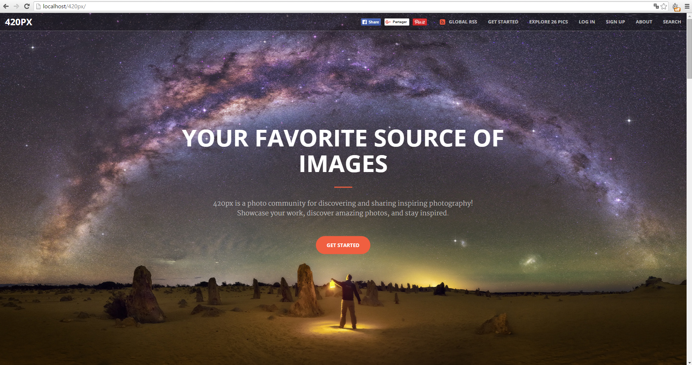
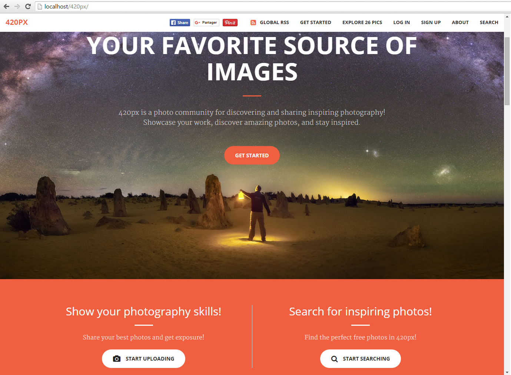
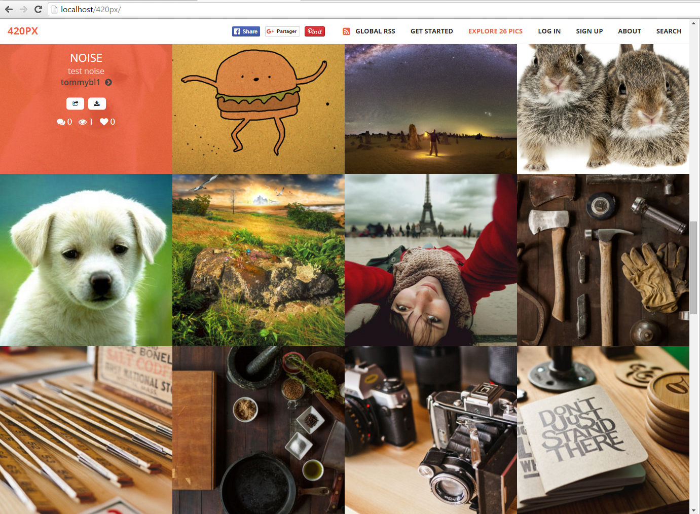
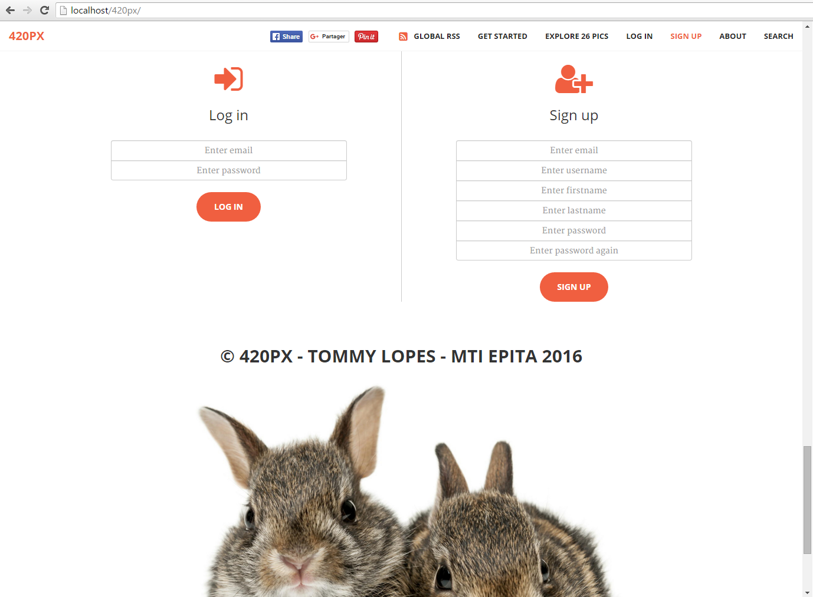
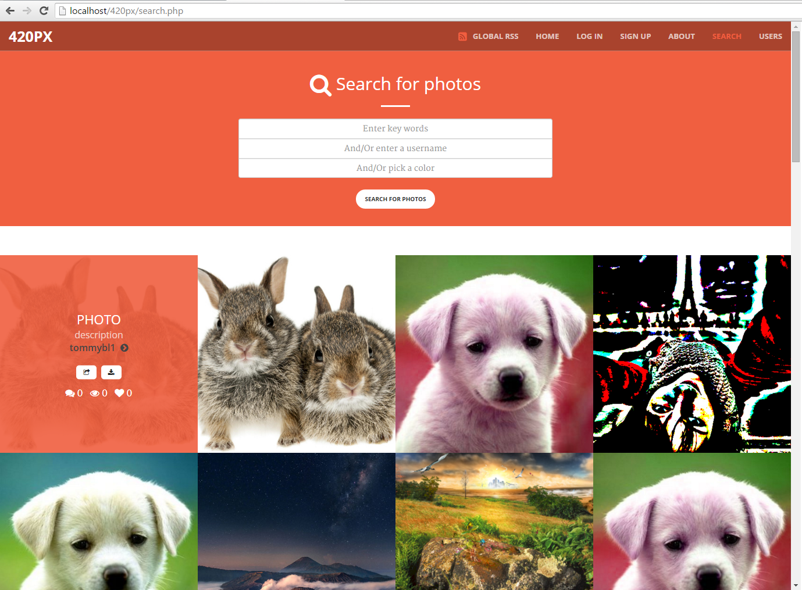
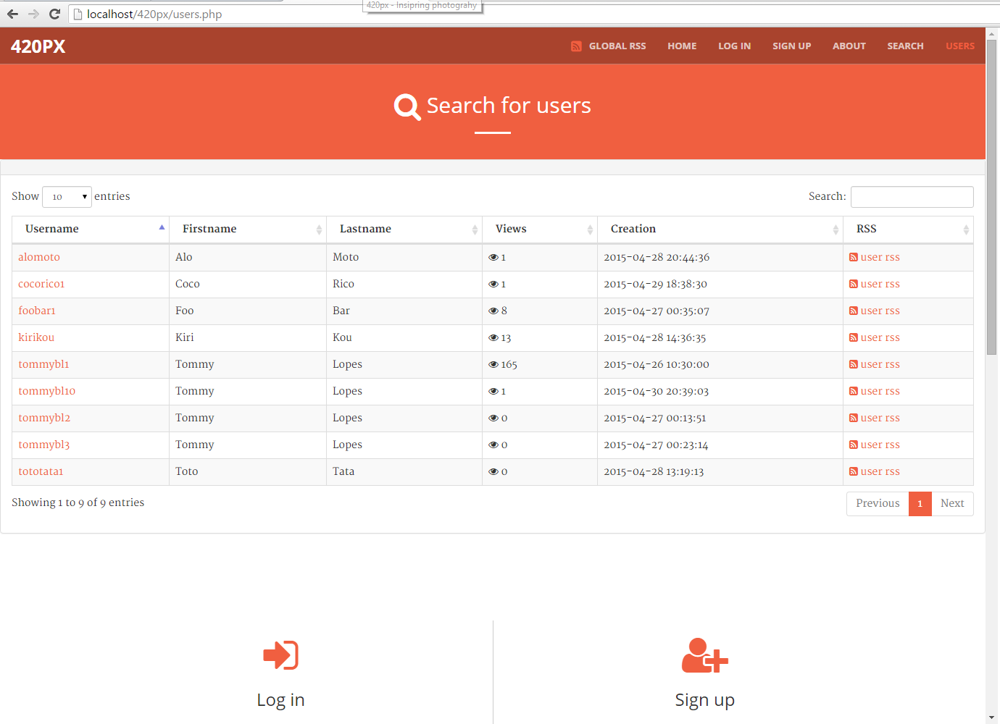
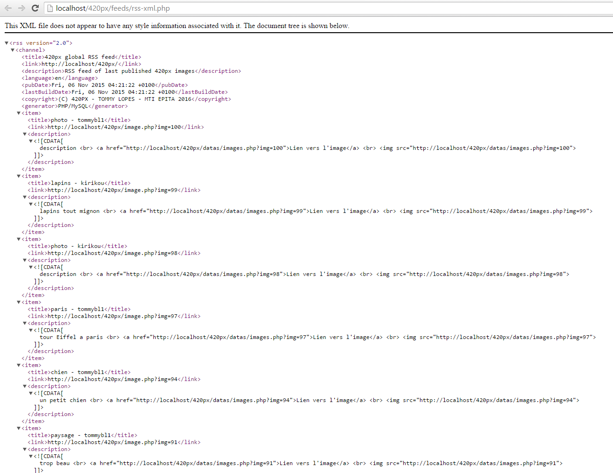
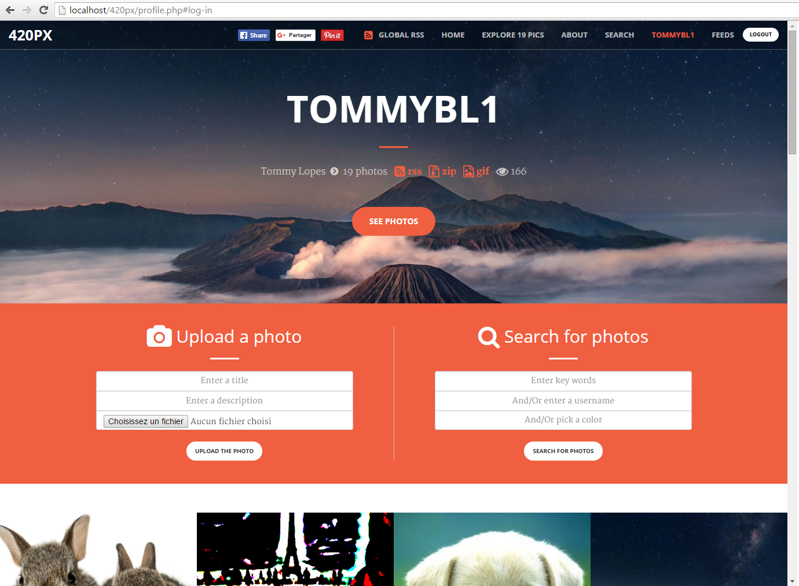
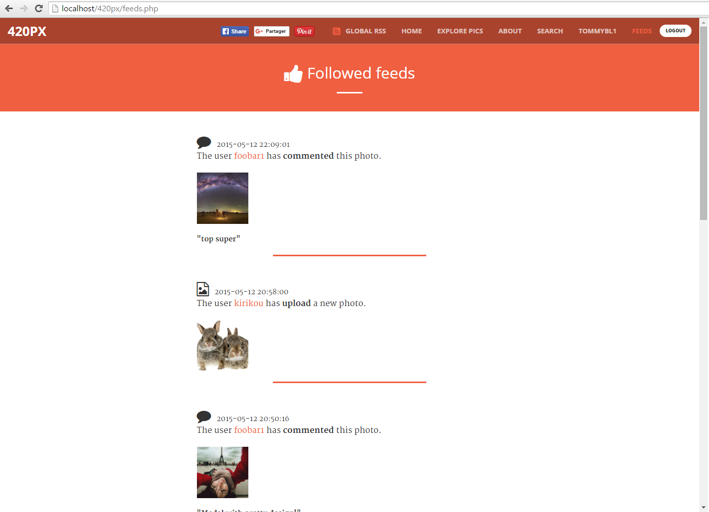
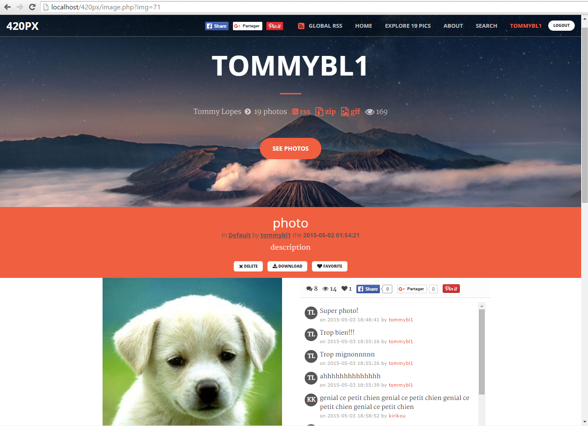

# 420px
> 500px Like (Photography social community) / PHP / Solo Project

* Project management, Conception, Design, Programming
* PHP5, MySQL, Imagick Library
* Solo Project

As part of a main project at EPITA for PHP learning, I had to create a 500px Like (leader in online photography community) in 1 month, with the most functionalities and without using any framework.

The final result was really satisfying, hosting a lot of functionalities:  
`Social community, hosting pictures, managing account and pictures, applying filters (30 possibilities) and transformations, comments, likes, favourites, following users (with news feed), sharing pictures on social networks etc.`

